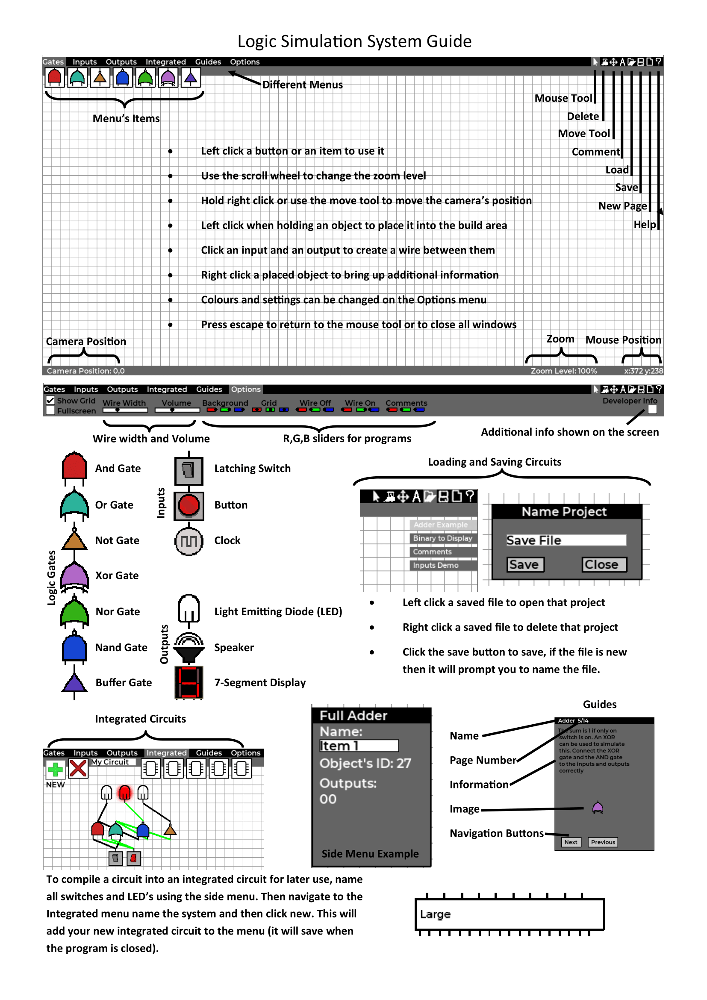

# Logic Simulation Tool
## Created as my A-Level Computer Science Project

Video: https://www.youtube.com/watch?v=pOFT-jUOVwg&t=211s

This program allows users to create basic circuits and CPU's from logic gates. I recommend reading 'Principles of Computer Hardware' for a better understanding of how to connect hardware components together in a meaningful way. The tool includes all basic gates and some custom microcontrollers (more can be created). There are also some basic guides for students, this was one of my first large independent projects.

## Program Guide

